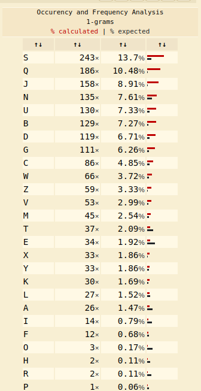

Level Info
Well done. You’ve moved past an easy substitution cipher.

Level Info = 'The main weakness of a simple substitution cipher is repeated use of a simple key. 
In the previous exercise you were able to introduce arbitrary plaintext to expose the key. 
In this example, the cipher mechanism is not available to you, the attacker.

However, you have been lucky. You have intercepted more than one message. 
The password to the next level is found in the file ‘krypton4’. You have also found 3 other files. (found1, found2, found3)

You know the following important details:

The message plaintexts are in American English (*** very important) - They were produced from the same key (*** even better!)'

My solution:

I got into Krypton 3 using the following command (I had already saved the password 'CAESARISEASY' in a file)

"$ sshpass -p $(cat 3.txt) ssh -p 2231 krypton3@krypton.labs.overthewire.org"

# We were given 3 found files and 2 hints.

I used this site to do frequency analyis.

That is the frequency analysis of English letters

The frequency analyis of found1:

The frequency analyis of found2:

The frequency analyis of found3:

As seen in the analysis above, in English letters, the letter 'e' occured most, but in the found files in krypton 3 , it is 'S'. 
'c' is substituted by 't' and so on.

After the English letter frequency is compared with the found files analysis,
we find the key.
We can apply 'tr' command and find the password.

